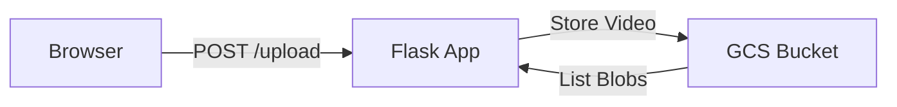

# Technical Design Document - Video Upload MVP

## 1. Introduction
This document outlines the architecture for the Video Upload MVP. The system limits scope to file uploads and listing, strictly utilizing Google Cloud Storage (GCS) as the backend.

## 2. System Overview

### 2.1 High-Level Architecture
The application is a monolithic Python Flask service. It handles HTTP requests and communicates directly with GCS.

## 3. Key Components

### 3.1 Web Application (Flask)
-   **Framework:** Flask.
-   **Deployment:** Local / Kubernetes.
-   **State:** Stateless; relies on GCS for data persistence.

### 3.2 Storage (GCS Bucket)
The GCS bucket acts as the file system.

**Bucket Structure:**
*   `{random_id}/video.mp4`: The video file, where `random_id` is a unique identifier generated for each upload.

## 4. Workflows

### 4.1 Upload
1.  **Receive:** User sends `POST /upload` with a video file.
2.  **Generate ID:** App generates a unique random ID for the video.
3.  **Save:** App streams the file to GCS under the path `{random_id}/video.mp4`.
4.  **Respond:** App redirects user to the Video List page.

### 4.2 Video List
1.  **List:** App iterates over blobs in the GCS bucket to find all video files (e.g., objects with paths like `*/video.mp4`).
2.  **Extract IDs:** For each video file, extract the `random_id` from its path.
3.  **Render:** HTML template displays a list of video identifiers (random IDs).

## 5. Technology Stack
-   **Language:** Python 3.9+
-   **Web Framework:** Flask
-   **Cloud Storage SDK:** `google-cloud-storage`

## 6. Trade-offs & Risks
-   **Scalability:** Listing thousands of files from GCS directly may become slow.
-   **Metadata:** No separate metadata store means we only know what's in the filename and GCS system metadata.